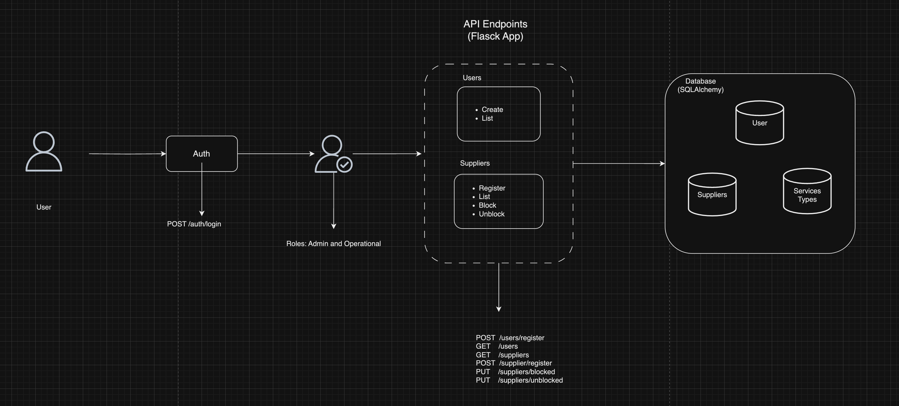
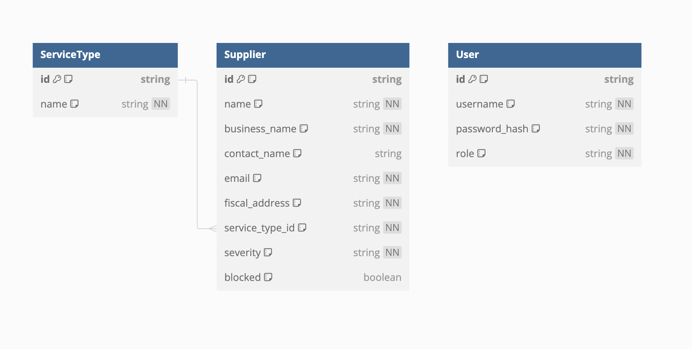
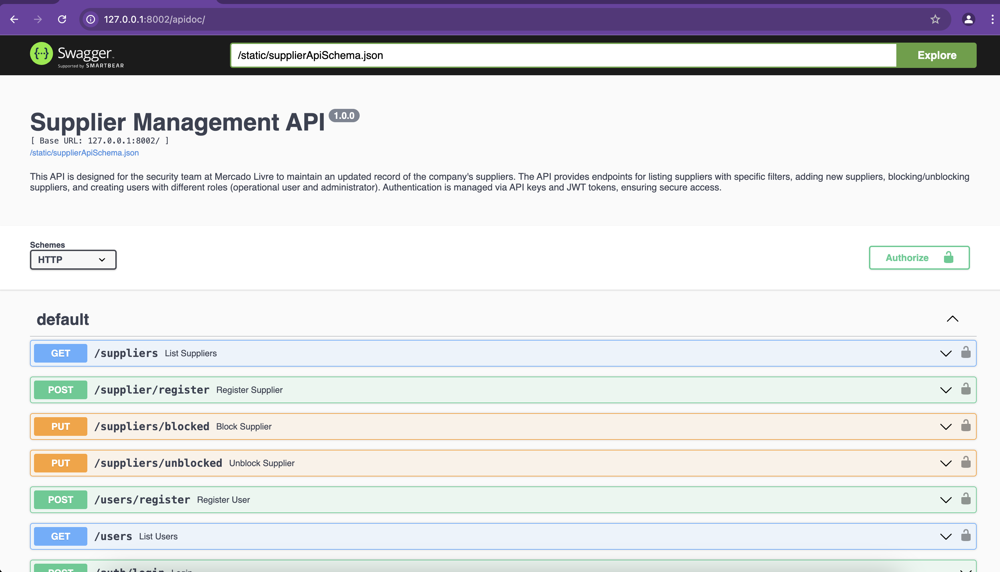
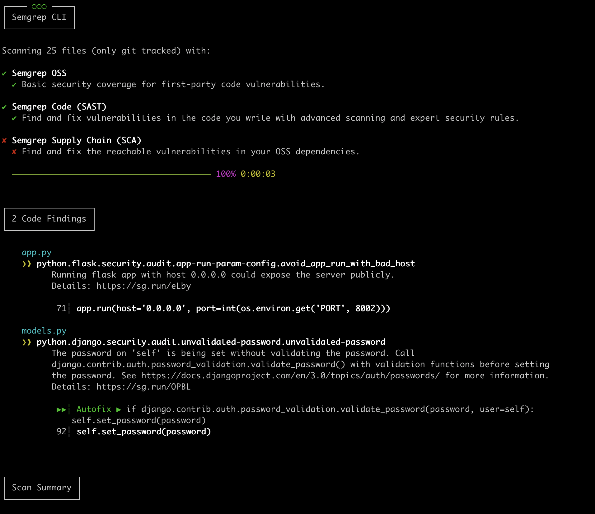

# Supplier Management API

This API is designed for the security team at Mercado Livre to maintain an updated record of the company's suppliers. The API provides endpoints for listing suppliers with specific filters, adding new suppliers, blocking/unblocking suppliers, and creating users with different roles (operational user and administrator). Authentication is managed via API Credentials and JWT tokens, ensuring secure access.

## Summary
- [Project Overview](#project-overview)
- [Architecture Diagram](#architecture-diagram)
- [Database Schema Diagram](#database-schema-diagram)
- [Entity-Relationship Diagram](#entity-relationship-diagram)
- [Installation and Setup](#installation-and-setup)
  - [Prerequisites](#prerequisites)
  - [Local Setup](#local-setup)
  - [Using Docker](#using-docker)
- [API Documentation](#API-Documentation)
- [Swagger Documentation](#Swagger-Documentation)
- [Running the Application](#running-the-application)
- [Cloud Deployment](#cloud-deployment)

## Project Overview

The Supplier Management API is a RESTful service developed with Python and Flask. It uses a SQLAlchemy database for storage and supports role-based authentication using JWTs. This API enables secure management of supplier data and user roles, with a focus on security and scalability.

## Architecture Diagram

Below is an overview of the architecture of the Supplier Management API.




## Database Schema Diagram

The database schema is designed to handle the necessary information about suppliers,services type,and users.

### Database Schema

This document describes the schema of the `Supplier` `Service Type` and `User` tables in the database.

Colocar o database schema aqui...


## Supplier Table

| Column Name     | Data Type | Constraints            | Description                                                     |
|-----------------|-----------|------------------------|-----------------------------------------------------------------|
| `id`            | String    | Primary Key (UUID)     | Unique identifier for each supplier.                            |
| `name`          | String    | Not Null               | Supplier's name.                                                |
| `business_name` | String    | Not Null               | Supplier's business name.                                       |
| `contact_name`  | String    | Not Null               | Name the contact person.                                     |
| `email`         | String    | Not Null               | Contact email address.                                          |
| `fiscal_address`| String    | Not Null               | Supplier's fiscal address.                                      |
| `service_type`  | String    | Foreign Key (UUID)     | Type of service provided, references `ServiceType.id`.          |
| `severity`      | String    | Not Null               | Severity level (low, medium, high, highest).                    |
| `blocked`       | Boolean   | Default: False         | Indicates if the supplier is blocked.                           |

## User Table

| Column Name     | Data Type | Constraints            | Description                                                     |
|-----------------|-----------|------------------------|-----------------------------------------------------------------|
| `id`            | String    | Primary Key (UUID)     | Unique identifier for each user.                                |
| `username`      | String    | Unique, Not Null       | Unique username for the user.                                   |
| `password_hash` | String    | Not Null               | Hashed password for user authentication.                        |
| `role`          | String    | Not Null               | Role of the user (operational, admin).                          |

## ServiceType Table

| Column Name | Data Type | Constraints            | Description                                |
|-------------|-----------|------------------------|--------------------------------------------|
| `id`        | String    | Primary Key (UUID)     | Unique identifier for each service type.   |
| `name`      | String    | Unique, Not Null       | Name of the service type (e.g., IT, HR).   |


## Entity-Relationship Diagram

The ER diagram shows the relationships between different entities in the database.



## Installation and Setup

### Prerequisites

Ensure you have the following installed on your system:

- Python 3.8 or higher
- pip (Python package installer)
- Docker and Docker Compose

### Local Setup

1. **Clone the repository**:

    ```bash
    git clone https://github.com/yourusername/supplier_management_api.git
    cd supplier_management_api
    ```

2. **Create a virtual environment**:

    ```bash
    python3 -m venv env
    source env/bin/activate
    ```

3. **Install the dependencies**:

    ```bash
    pip install -r requirements.txt
    ```

4. **Set up environment variables**:

    Copy the `.env.example` file to `.env` and configure your environment variables as needed.
    ```
    SECRET_KEY=your_secret_key_here
    JWT_SECRET_KEY=your_jwt_secret_key_here
    DATABASE_URL=sqlite:///database.db  # or database URI
    JWT_EXPIRATION_HOURS=1
    ADMIN_PASSWORD=your_admin_password_here

    ```
### Using Docker

1. **Build and run the Docker containers**:

    ```bash
    docker-compose --build
    ```
    ```bash
    docker-compose up -d
    ```
2. **Access the API**:

    The API will be available at `http://localhost:8002`.


## API Documentation

This document details all available endpoints in the Supplier Management API, including the HTTP methods, URLs, descriptions, and example usage. The response codes are also provided for each endpoint.

### Endpoints Overview

| Method | URL                        | Description                               | Response Codes              |
|--------|----------------------------|-------------------------------------------|-----------------------------|
| POST   | `/auth/login`              | Authenticate user and receive a JWT.      | 200, 401, 500               |
| GET    | `/suppliers`               | List all suppliers with optional filters. | 200, 404, 500               |
| POST   | `/supplier/register`       | Add a new supplier.                       | 201, 400, 500               |
| PUT    | `/suppliers/blocked`       | Block a supplier.                         | 200, 400, 403, 404, 500     |
| PUT    | `/suppliers/unblocked`     | Unblock a supplier.                       | 200, 400, 403, 404, 500     |
| POST   | `/users/register`          | Create a new user.                        | 201, 400, 403, 500          |
| GET    | `/users`                   | List all users.                           | 200, 403, 404, 500          |

### Authentication

#### `POST /auth/login`

**Description:** Authenticate user and receive a JWT.

**Request Example:**
```bash
curl -X POST http://localhost:8002/auth/login \
-H "Content-Type: application/json" \
-d '{
  "username": "your_username",
  "password": "your_password"
}'
```

**Response Example:**

```json
{
  "token": "jwt_token"
}
```

**Response Codes:**

- `200 OK`: Authentication successful, JWT returned.
- `401 Unauthorized`: Invalid API key or token.
- `500 Internal Server Error`: An error occurred on the server.

### Supplier Management

#### `GET /suppliers`

**Description:** List all suppliers with optional filters.

**Request Example:**
```bash
curl -X GET http://localhost:8002/suppliers
```

**Response Example:**
```json
[
  {
    "name": "Supplier A",
    "service_type": "IT Services",
    "severity": "High"
  },
]

```

**Response Codes:**
- `200 OK`: Suppliers listed successfully.
- `404 Not Found`: No suppliers found.
- `500 Internal Server Error`: An error occurred on the server.

#### `POST /supplier/register`

**Description:** Add a new supplier.

**Request Example:**
```bash
curl -X POST http://localhost:8002/supplier/register \
-H "Content-Type: application/json" \
-d '{
  "name": "Supplier B",
  "business_name": "Business B",
  "contact_name": "Contact B",
  "email": "contact@supplierb.com",
  "fiscal_address": "Address B",
  "service_type": "Consulting",
  "severity": "Medium"
}'

```

**Response Example:**
```json
{
  "id": "UUID",
  "name": "Supplier B",
  "business_name": "Business B",
  "contact_name": "Contact B",
  "email": "contact@supplierb.com",
  "fiscal_address": "Address B",
  "service_type": "Consulting",
  "severity": "Medium",
  "blocked": false
}

```

**Response Codes:**

- `201 Created`: Supplier added successfully.
- `400 Bad Request`: Invalid input data.
- `500 Internal Server Error`: An error occurred on the server.

#### `PUT /suppliers/blocked`

**Description:** Block a supplier.

**Request Example:**
```bash
curl -X PUT http://localhost:8002/suppliers/blocked \
-H "Content-Type: application/json" \
-d '{
  "id": "UUID"
}'

```

**Response Example:**

```json
{
  "id": "UUID",
  "name": "Supplier B",
  "status": "Blocked"
}
```

**Response Codes:**

- `200 OK`: Supplier blocked successfully.
- `400 Bad Request`: Invalid input data.
- `403 Forbidden`: Only admins can block suppliers.
- `404 Not Found`: Supplier not found.
- `500 Internal Server Error`: An error occurred on the server.

#### `PUT /suppliers/unblocked`

**Description:** Unblock a supplier.

**Request Example:**
```bash
curl -X PUT http://localhost:8002/suppliers/unblocked \
-H "Content-Type: application/json" \
-d '{
  "id": "UUID"
}'
```

**Response Example:**
```json
{
  "id": "UUID",
  "name": "Supplier B",
  "status": "Unblocked"
}
```

**Response Codes:**
- `200 OK`: Supplier unblocked successfully.
- `400 Bad Request`: Invalid input data.
- `403 Forbidden`: Only admins can block suppliers.
- `404 Not Found`: Supplier not found.
- `500 Internal Server Error`: An error occurred on the server.

### User Management

#### `POST /users`

**Description:** Create a new user.

There is two roles to apply:
`admin` and `operational`.

**Request Example:**
```bash
curl -X POST http://localhost:8002/users/register \
-H "Content-Type: application/json" \
-d '{
  "username": "newuser",
  "password": "password",
  "role": "role" 
}'

```

**Response Example:**
```json
{
  "id": "UUID",
  "username": "newuser",
  "role": "operational"
}
```

**Response Codes:**

- `201 Created`: User created successfully.
- `400 Bad Request`: Invalid input data.
- `403 Forbidden`: Only admins can create users.
- `500 Internal Server Error`: An error occurred on the server.

#### `GET /users`

**Description:** List all users.

**Request Example:**
```bash
curl -X GET http://localhost:8002/users

```

**Response Example:**
```json
[
  {
    "id": "UUID",
    "username": "user1",
    "role": "role"
  },
  {
    "id": "UUID",
    "username": "user2",
    "role": "role"
  }
]

```

**Response Codes:**

- `200 OK`: Users listed successfully.
- `403 Forbidden`: Only admins can view users.
- `404 Not Found`: No users found.
- `500 Internal Server Error`: An error occurred on the server.


## Swagger Documentation

The Supplier Management API includes an interactive Swagger UI documentation, which provides a user-friendly interface for exploring and testing the API endpoints.

### Accessing Swagger UI

After running the application, the Swagger UI can be accessed at:

```
http://127.0.0.1:8002/apidoc
```




### Features of Swagger UI:

- **Interactive API Documentation**: Swagger UI provides an interactive interface to view and test the API endpoints.
- **Auto-generated Documentation**: Based on the OpenAPI specification, the documentation is automatically generated and updated as you modify the API.
- **Easy Testing**: Developers can easily test API endpoints directly from the Swagger UI without needing additional tools like Postman.
- **Error Handling**: Swagger UI shows detailed error messages and status codes, helping in debugging and improving the API.


## Running the Application

To run the application using Docker and Docker Compose:

1. **Ensure Docker and Docker Compose are installed** on your machine.

2. **Clone the repository**:

```bash
git clone https://github.com/yourusername/supplier_management_api.git
cd supplier_management_api
```

3. **Build and start the containers**:

```bash
docker-compose up --build -d
```

This command will build the Docker image for the application and start the containers in detached mode.

4. **Access the API**:

The API will be available at `http://localhost:8002`.

5. **Check the running containers**:

 You can verify that the containers are running with:

```bash
docker-compose ps
```

6. **Stopping the application**:

To stop the application and remove the containers, run:

```bash
docker-compose down
```

7. **Logs**:

To view the logs from the running containers, use:

```bash
docker-compose logs -f
```

This setup ensures that the application is containerized, making it easier to deploy and run in different environments with consistent behavior.

## Cloud Deployment

To deploy this application in a cloud environment, follow these general steps:

1. **Select a Cloud Provider**:

    Choose a cloud provider such as AWS, Azure, or Google Cloud.

2. **Provision Resources**:

    - **Compute**: Use a VM (e.g., EC2 on AWS) or a container service (e.g., AWS ECS, Azure AKS).
    - **Database**: Set up a managed database service if needed, such as AWS RDS.

3. **Containerize the Application**:

    - Build the Docker image and push it to a container registry (e.g., Docker Hub, AWS ECR).
    - Pull the image in your cloud environment and run it.

4. **Set Up Environment Variables**:

    Configure environment variables in your cloud environment, such as through AWS SSM or Azure Key Vault.

5. **Deploy and Monitor**:

    Deploy the application and monitor its performance, ensuring scalability and reliability.

## Security Testing

As part of our commitment to ensuring the security of the Supplier Management API, we have implemented security testing using [Semgrep](https://semgrep.dev/). Semgrep is a powerful static analysis tool that scans code for potential security vulnerabilities, misconfigurations, and best practice violations.


### Output

Here is an output after scanning your codebase:



1. python.flask.security.audit.app-run-param-config.avoid_app_run_with_bad_host: 
  `You must set the API IP addrres, otherwise when run the security tests this masage will appearing. `

2. python.django.security.audit.unvalidated-password.unvalidated-password:`The reason it is appearing, it beacouse I set my own password police`

### Custom Semgrep Rules

You can create custom rules to tailor the security checks to the specific needs of your project. More information about writing custom rules can be found in the [Semgrep documentation](https://semgrep.dev/docs/writing-rules/).

### Integrating Semgrep with CI/CD

To ensure continuous security, you can integrate Semgrep into your CI/CD pipeline. This will automatically scan your code for vulnerabilities with every commit or pull request, helping to prevent security issues from reaching production.

### Security Testing Best Practices

- **Run Semgrep regularly**: Make security scanning part of your development workflow by running Semgrep regularly.
- **Review findings**: Take time to review and address any findings from the Semgrep scan.
- **Keep Semgrep up to date**: Regularly update Semgrep and its rules to benefit from the latest security checks and best practices.

By incorporating Semgrep into our security practices, we aim to proactively identify and mitigate potential security risks in our codebase.
